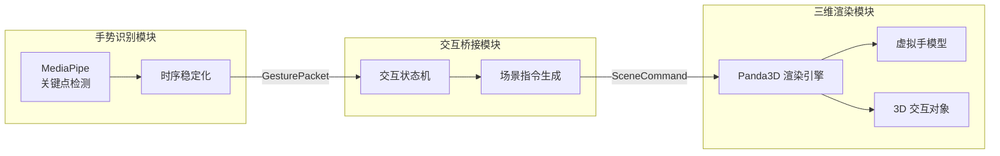

# 系统架构流程图

## 数据流总览

```mermaid
flowchart LR
    CAM["📷 摄像头"]
    GS["手势识别模块\nGesture Service"]
    BS["交互桥接模块\nBridge Service"]
    RS["三维渲染模块\nRendering Service"]

    CAM -->|视频帧| GS
    GS -->|GesturePacket| BS
    BS -->|SceneCommand| RS
```

## 各模块内部结构

```mermaid
flowchart LR
    subgraph GS["手势识别模块"]
        ML["MediaPipe\n关键点检测"]
        TR["时序稳定化"]
        ML --> TR
    end

    subgraph BS["交互桥接模块"]
        IA["交互状态机"]
        SC["场景指令生成"]
        IA --> SC
    end

    subgraph RS["三维渲染模块"]
        P3D["Panda3D 渲染引擎"]
        VH["虚拟手模型"]
        OBJ["3D 交互对象"]
        P3D --> VH
        P3D --> OBJ
    end

    TR -->|GesturePacket| IA
    SC -->|SceneCommand| P3D
```
