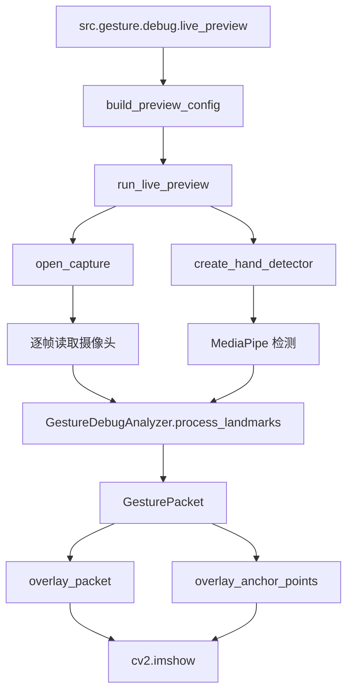

# Gesture Workflow

## 目标

这个文件描述 gesture 模块当前的最小可用工作流，覆盖三条主线：

1. 实时 GestureInputServiceImpl 如何产出可供 bridge 消费的 GesturePacket。
2. debug 入口如何驱动实时预览窗口与健康检查。
3. 实时窗口如何叠加骨架、锚点、坐标和 GesturePacket 信号。

实现文件：

- service 实现入口：src/gesture/service.py
- 兼容导出层：src/gesture/service.py
- gesture debug 入口：src/gesture/debug/live_preview.py
- 实时预览与调试管线：src/gesture/debug/live_preview_runtime.py

## 模块职责边界

gesture 模块只负责把输入后端转换为有序 GesturePacket 流，不负责 bridge 语义映射，也不负责 rendering 执行。

- 输入：摄像头帧或录制视频帧。
- 中间结果：手部关键点、tracking_state、pinch_state、confidence、velocity。
- 输出：符合 src/contracts.py 中 GesturePacket 契约的消息流。

## 运行总流程

```mermaid
flowchart TD
    A[start()] --> B[_reset_runtime_state]
    B --> C[_setup_backend]
    C --> D[RUNNING]
    D --> E[poll()]
    E --> F[_read_frame]
    F --> G[_detect_hand]
    G --> H[_compute_tracking_state]
    G --> I[_compute_pinch_state]
    H --> J[_compute_confidence]
    I --> J
    J --> K[_smooth_vec3 / _compute_velocity]
    K --> L[_build_packet]
    L --> M[GesturePacket -> bridge]
    D --> N[health()]
    D --> O[stop()]
    O --> P[_teardown_backend]
    P --> Q[STOPPED]
```

## GestureInputServiceImpl 工作流

### 1. start()

start() 的目标是把服务从 STOPPED 拉到 RUNNING。

- 如果已经启动，直接幂等返回。
- 状态切换顺序固定为 STOPPED -> INITIALIZING -> RUNNING。
- 先重置运行时字段。
- 再初始化真实输入后端。
- 后端初始化失败时：
  - 记录结构化错误并保留最近一条错误摘要到 stats.last_error。
  - 状态切换为 DEGRADED。
  - 继续抛异常，不静默吞掉。

当前后端初始化逻辑在 _setup_backend() 中：

- 用 OpenCV 打开 camera_index 对应摄像头。
- 构造 GestureRuntimeConfig。
- 通过 src/gesture/runtime.py 中的 create_hand_detector() 获取 MediaPipe 检测器。
- 如果当前环境没有可用 detector，直接失败，并明确提示默认模型路径，而不是回退成假数据流。

这保证了服务对主程序是诚实的：能跑就 RUNNING，不能跑就 DEGRADED。

### 2. poll()

poll() 是主处理路径，每调用一次处理一帧。

#### 路径 A：服务未启动

- 直接返回 None。

#### 路径 B：成功读取一帧并检测到手

处理顺序如下：

1. _read_frame() 从摄像头读取 BGR 帧，并给出 timestamp_ms。
2. _resolve_timestamp_ms() 保证时间戳单调递增。
3. _detect_hand() 用 MediaPipe 检测关键点。
4. _normalize_vec3() 把坐标限制到 [-1.0, 1.0]。
5. _compute_tracking_state() 生成 tracked。
6. _compute_pinch_state() 用距离阈值和滞回生成 pinch 状态。
7. _compute_confidence() 生成 0 到 1 的置信度。
8. _smooth_vec3() 对 index_tip、thumb_tip、palm_center 做线性平滑。
9. _compute_velocity() 用当前 palm_center 和上一帧 palm_center 求速度。
10. _build_packet() 构造完整 GesturePacket。

#### 路径 C：成功读取一帧，但这一帧没检测到手

服务不会崩溃，而是继续输出一个合法包：

- tracking_state 从 tracked 逐步进入 temporarily_lost，再进入 not_detected。
- pinch_state 会在已有 pinch 相关状态下先进入 release_candidate，再回到 open。
- index_tip、thumb_tip、palm_center 沿用上一帧缓存值。
- confidence 在 temporarily_lost 时给低但非零值，在 not_detected 时降到 0。

这样 bridge 端收到的是连续但降级的信号流，而不是突然断流。

#### 路径 D：后端失败

例如摄像头读帧失败或 detector 抛异常：

- errors 追加一条结构化 backend failure 记录。
- lifecycle_state 切到 DEGRADED。
- 抛出 RuntimeError，错误文本是 Gesture input backend failure。

### 3. pinch_state 状态机

pinch_state 使用距离阈值和短窗口确认帧数来抑制抖动。

- pinch_hold_threshold：进入稳定 pinched 的更紧阈值。
- pinch_enter_threshold：进入 pinch_candidate 的较宽阈值。
- pinch_release_threshold：从 pinched 或 candidate 退出时使用更松的释放阈值。

状态流大致如下：

```text
open
  -> pinch_candidate   手指距离进入捏合候选区
  -> pinched           连续多帧满足更紧阈值
  -> release_candidate 从 pinched 退出时先短暂释放确认
  -> open
```

这种滞回设计避免了在边界距离附近出现 open/pinched 来回抖动。

### 4. tracking_state 状态机

tracking_state 使用 tracking_loss_streak 表示连续丢失帧数：

- 当前帧检测到手：tracked。
- 连续少量帧未检测到手：temporarily_lost。
- 连续更多帧未检测到手：not_detected。

它的作用是把短暂遮挡和真正丢失手部分开处理。

### 5. health()

health() 是无副作用快照，只返回状态，不做任何 I/O：

- component
- lifecycle_state
- status
- errors
- stats.started
- stats.frame_id
- stats.hand_id
- stats.tracking_state
- stats.pinch_state
- stats.confidence
- stats.tracking_loss_streak
- stats.last_error
- stats.detector_backend
- stats.polls_attempted / packets_emitted / tracked_packets / empty_packets / backend_failures

### 6. stop()

stop() 负责资源释放和状态回收：

- 已经 STOPPED 时幂等返回。
- 释放 capture 和 detector。
- started 置为 False。
- lifecycle_state 置为 STOPPED。
- 清理失败只追加可恢复错误，不让整个进程崩掉。

## 实时运行路径

src/gesture/debug/live_preview.py 提供 gesture 模块的专用 debug 入口。

### 普通实时模式

这个入口面向实时观察摄像头画面、手部骨架和 GesturePacket 流：

1. live_preview.py 使用 GesturePreviewConfig 提供 camera_index、target_fps、window_name 等调试配置。
2. build_preview_config() 组装实时预览配置。
3. live_preview_runtime.py 中的 run_live_preview() 打开摄像头和窗口。
4. create_hand_detector() 执行 MediaPipe 检测。
5. overlay_packet() 与 overlay_anchor_points() 在画面上叠加状态、锚点。
6. 按 q 或 Esc 退出窗口。

适合场景：

- 看服务是否能实时产包。
- 看 tracking_state / pinch_state 是否稳定。
- 看窗口里 index_tip、thumb_tip、palm_center 的实时锚点和坐标。

## 实时预览路径



实时预览窗口当前会展示：

- 手部骨架。
- index_tip、thumb_tip、palm_center 三个锚点。
- camera_norm 坐标。
- tracking_state、pinch_state、confidence、pinch_distance。
- report.md
  人类可读摘要。

## 手指锚点与信号操作思路

录制的核心价值不是单纯存视频，而是把视频帧和手势状态对齐成可以分析的锚点流。

### 1. 基础几何信号

当前使用三个主要空间点：

- index_tip
- thumb_tip
- palm_center

其中：

- pinch_distance = distance(index_tip, thumb_tip)
- velocity = 当前 palm_center - 上一帧 palm_center

这两类信号分别描述：

- 手指是否正在接近形成 pinch。
- 手掌是否在做平移运动。

### 2. 事件锚点

build_event_anchors() 会把状态跃迁固化成事件锚点：

- session_start
- tracking_state_change
- pinch_state_change

这些锚点可以帮助你做几类分析：

- 看骨架是否跟手移动。
- 看 pinch_candidate 到 pinched 的切换是否稳定。
- 看 thumb 和 index 的锚点距离是否与 pinch_distance 一致。

### 3. 录制后的常见分析方法

- 如果窗口中手已经明显进入画面但状态长时间没有 tracked，优先检查 detector backend 或模型文件。
- 如果 pinch_distance 明显变小，但状态始终停在 open，优先调 pinch_enter_threshold 和 pinch_hold_threshold。
- 如果 pinched 和 open 来回跳，优先看 release_threshold 是否太小，或者确认帧数是否太短。
- 如果 tracking_state 经常从 tracked 直接掉到 not_detected，说明暂失窗口太短，应该先保留 temporarily_lost 缓冲。

## 代码阅读顺序建议

如果要快速理解当前实现，建议按这个顺序读：

1. src/gesture/service.py
   先看 start() / poll() / health() / stop() 四个公开函数。
2. src/gesture/service.py
   再看 _setup_backend()、_detect_hand()、_compute_pinch_state()。
3. src/gesture/debug/live_preview.py
  看 debug 入口如何组装实时预览配置。
4. src/gesture/debug/live_preview_runtime.py
  看 run_live_preview()、GestureDebugAnalyzer、overlay_anchor_points()。

## 当前实现结论

当前 gesture 模块的设计思路是：

- 用 service.py 作为正式的 GestureInputPort 实现。
- 用 debug/live_preview.py 作为专用调试入口。
- 用 debug/live_preview_runtime.py 作为实时预览与检测辅助工具。
- 用统一的 GesturePacket 契约把服务输出和窗口叠加信息对齐。

这样一来，实时服务、录制分析、后续 bridge 消费三者共用同一组状态语义，而不是三套互相分叉的数据定义。
